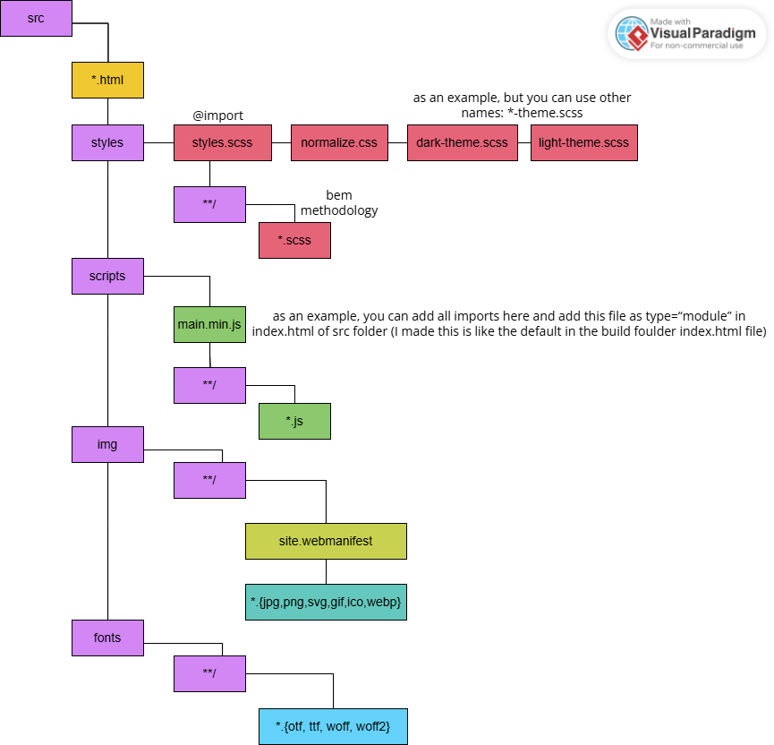
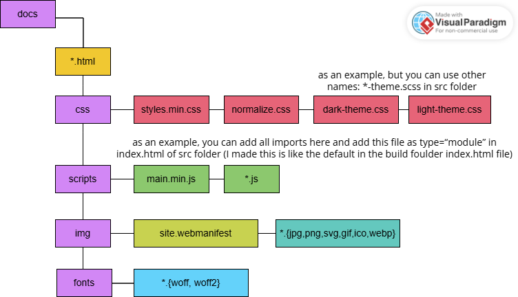
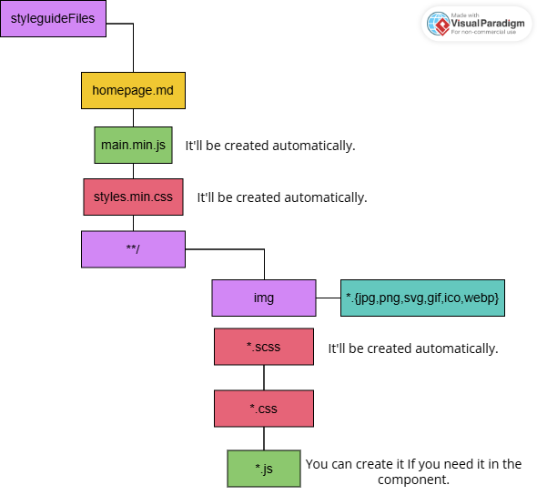

  
  
<strong>Простая сборка на Gulp</strong>

  

Может использоваться как основа для составления собственной сборки

+ небольшая «Библиотека Компонентов»

---

## Функционал сборки:

- Минификация HTML
- Компиляция препроцессора SCSS
- Автоматическое добавление префиксов CSS
- Минификация CSS
- Преобразования кода ECMAScript 2015 + в обратно совместимую версию JavaScript с помощью Babel
- Минификация JavaScript
- Объединение нескольких файлов JavaScript в один
- Сжатие изображений
- Конвертирование изображений в .webp формат
- Отслеживание новых изображений, которые еще не были сжаты
- Конвертация шрифтов в форматы woff, woff2
- Отслеживание изменений в файлах и автоматический запуск повторной сборки
- Генерация SourceMaps
- Отображение размеров файлов в терминале
- Локальный сервер с автоматическим обновлением страницы при изменении файлов
- Создание .zip архива проекта
- Стартовый шаблон index.html с подключенными файлом стилей, normilize.css и файлом js для быстрого начала верстки
- Поддержка модулей ES6
- Поддержка добавления темы (темной/светлой)
- «Библиотека Компонентов»
- Использование .webmanifest для favicons

## Структура src папки проекта:

## Структура dist папки проекта:

## Запуск gulp сборки:

Для работы сборки вам понадобится скачать и установить node.js.  
Во избежании всевозможных ошибок вам необходимо установить gulp глобально, но это в случае если вы еще не делали этгого в других проектах: `npm i gulp -g`. Эта процедура делается один раз и в следующий раз, когда будете разворачивать новый проект повторять эту команду не потребуется.  
Также установите систему контроля версии Git. Для работы сборки Git не обязателен, но для удобства установки и дальнейшей разработки лучше все же установить.

1. Создать себе папку проекта
2. Выполнить в ней команду git clone: `git clone https://github.com/Shipy4kaRU/gulp-build-2024.git` (или скачать сборку архивом .zip и разархивировать)
3. После того как все исходники будут скачаны из удаленного репозитория, введите в консоли команду: `npm i` (для этого должен быть установлен node.js)
4. Создать каталоги и файлы в соответствии со структурой проекта
5. Выполнить команду: gulp (запуска default задачи)
6. Писать свой код и наслаждаться автоматической сборкой проекта.

#### При запуске помимо сборки запустится «Библиотека Компонентов», где во вкладке 0. Overview будет ее описание. Ниже приведена необходимая структура файлов библиотеки. Чтобы лучше ее понять - можете просмотреть уже созданные мною файлы библиотеки компонентов.

## Используемые NPM-пакеты:

- ["@babel/core"](https://www.npmjs.com/package/@babel/core): Ядро Babel
- ["@babel/preset-env"](https://www.npmjs.com/package/@babel/preset-env): Пресет для компиляции Babel
- ["browser-sync"](https://www.npmjs.com/package/browser-sync): Автоматическое обновление сайта при изменении файлов
- ["del"](https://www.npmjs.com/package/del): Удаление каталогов и файлов
- ["gulp"](https://www.npmjs.com/package/gulp): Сборщик Gulp
- ["gulp-autoprefixer"](https://www.npmjs.com/package/gulp-autoprefixer): Автоматическое добавление префиксов в CSS
- ["gulp-babel"](https://www.npmjs.com/package/gulp-babel): Преобразует Java Script в старый стандарт
- ["gulp-clean-css"](https://www.npmjs.com/package/gulp-clean-css): Минификация и оптимизация CSS файлов
- ["gulp-concat"](https://www.npmjs.com/package/gulp-concat): Объединение нескольких файлов в один
- ["gulp-flatten"](https://www.npmjs.com/package/gulp-flatten): Удаление или заменена относительного пути к файлам
- ["gulp-fonter"](https://www.npmjs.com/package/gulp-fonter): Конвертация шрифтов в .tff и woff форматы
- ["gulp-htmlmin"](https://www.npmjs.com/package/gulp-htmlmin): Минификация HTML файлов
- ["gulp-ignore"](https://www.npmjs.com/package/gulp-ignore): Включение или исключение файлов gulp из потока на основе условия
- ["gulp-imagemin"](https://www.npmjs.com/package/gulp-imagemin): Сжатие изображений
- ["gulp-newer"](https://www.npmjs.com/package/gulp-newer): Отслеживание только новых файлов
- ["gulp-rename"](https://www.npmjs.com/package/gulp-rename): Переименование файлов
- ["gulp-replace"](https://www.npmjs.com/package/gulp-replace): Плагин замены строк для gulp
- ["gulp-sass"](https://www.npmjs.com/package/gulp-sass): Компиляция Sass и Scss файлов
- ["gulp-size"](https://www.npmjs.com/search?q=gulp-size): Отображение информации о размерах файлов в терминале
- ["gulp-sourcemaps"](https://www.npmjs.com/package/gulp-sourcemaps): Карта строк кода для инструментов разработчика
- ["gulp-transform"](https://www.npmjs.com/package/gulp-transform): Плагин Gulp для применения пользовательских преобразований к содержимому файла
- ["gulp-ttf2woff2"](https://www.npmjs.com/package/gulp-ttf2woff2): Конвертация шрифтов из .ttf формата в woff2
- ["gulp-uglify"](https://www.npmjs.com/package/gulp-uglify): Сжатие и оптимизация JavaScript кода
- ["gulp-webp"](https://www.npmjs.com/package/gulp-webp): Конвертация изображений в WebP
- ["gulp-zip"](https://www.npmjs.com/package/gulp-zip): Создание .zip архива
- ['kss'](https://www.npmjs.com/package/kss): Это Node.js реализация KSS, "синтаксиса документации для CSS"
- ['live-server'](https://www.npmjs.com/package/live-server): Это небольшой сервер разработки с возможностью перезагрузки в реальном времени
- ["sass"](https://www.npmjs.com/package/sass): Компилятор Sass

## Команды сборки:

- `gulp`: обрабатывает html, css, js-файлы, оптимизирует и обрабатывает новые фото и переносит все в папку **dist/** (но без шрифтов). После запускает «Библиотеку Стилей».
- `gulp fonts`: конвертирует шрифты в форматы woff, woff2 и переносит все это в папку **dist/fonts/**
- `gulp zip`: создает .zip архив папки dist (название берется из главной папки проекта) и располагает его в главной папке проекта на равне с папками dist и src
- `gulp webp`: конвертирует изображения в .webp формат.

---
